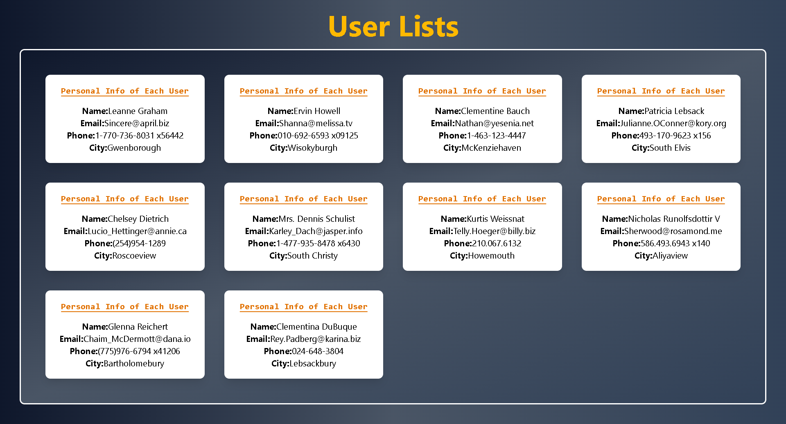

# 🚀 React User Fetch App

A simple React project that fetches **user data** from the [JSONPlaceholder API](https://jsonplaceholder.typicode.com/users) and displays it beautifully with Tailwind CSS.

---

## 📸 Screenshots

### 🏠 Home Page



---

## ✨ Features

- 🔄 Fetches live user data from API
- ⏳ Displays a loading message while fetching
- 📋 Renders user details (Name, Email, Phone, City)
- 🎨 Styled with Tailwind CSS (responsive design, gradient backgrounds, cards, shadows, etc.)
- ⚡ Clean and simple code structure

---

## 🛠️ Technologies Used

- [React](https://reactjs.org/) – Frontend framework
- [Tailwind CSS](https://tailwindcss.com/) – Styling
- [JSONPlaceholder API](https://jsonplaceholder.typicode.com/) – Free fake API for testing

---

## 📂 Project Structure

.
├── src
│ ├── App.js # Main component fetching and displaying data
│ ├── index.js # React DOM entry point
│ └── styles.css # Tailwind CSS styles
├── public
│ └── index.html
├── package.json
└── README.md

---

## ⚙️ Installation & Setup

1. **Clone the repo**
   ```bash
   git clone https://github.com/F20RSEEN1M01023H/Fetch-Api-Data.git
   ```

Navigate into project folder

cd react-user-fetch

Install dependencies

npm install

Run the app

npm start

🚀 Usage

Open the app in your browser at http://localhost:3000/

The app will automatically fetch and display users.

Each user card shows:

Name

Email

Phone

City

🤝 Contribution

Contributions, issues, and feature requests are welcome!
Feel free to fork the repo and submit a pull request.
